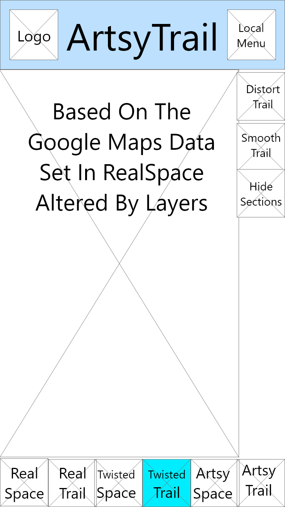

## Phase 2: Interaction Design

Here are some early drafts of our wireframes as exported from Adobe XD at 30% normal size.  They are organized roughly by purpose alongisde our thought processes while creating and refinining them.

### Base Menus

 

Warren: We had some false starts using several early artboards where clicking disabled buttons led to frustration.  After that, we made sure to indicate which portions of the screen visible behind the active dialog box or menu were currently inactive by 'greying' them out.
 
Henry: The Local Menu has the main focus of being your go to for navigating out of the main app as well as exporting and or saving data.
it's positioning in the familiar top-right corner is key as you would expect such behavior to reside there. This menu can be reached from any of the 'space' or 'trail' sections of the app when a user is looking at map data

### Info & Settings
  

Warren: Not shown is the duplicate How To Use page that links back to the local menu rather than the main one.

Shan: The middle "How To Use" page is helpful since some of the terminology might be hard to understand for someone who might not be too technologically inclined.

### Data Management: Input

   

Shan: Allows a user to import previous data. Can help with possibly seeing where a pet has wandered before, to try to get a feel for where they may have gone if they are lost.

### Data Management: Output

Warren: We were surprised that our survey, which as noted was filled out with 'mock' data by our fellow students, showed the popularity of Instagram outshining that of Facebook.  We made sure to provide labeled export buttons for convenient posting to those two and several other notable social networks.
 
Henry: Both exporting and saving are reached via the local menu, the descision to 'sub-menu' these into a local menu felt natural as opposed to having seperate share/save icons cluttering the main view of the app.

### RealSpace

Shan: We decided it would be good to give different views to the user, for either finding their pet, or make the map prettier to upload to social media, this is what the RealSpace/Trail, TwistedSpace/Trail, and ArtsySpace/Trail are for. For example, if a user wanted to upload a map of their pets travels throughout the night, they could take advantage of the ArtsySpace/Trail.

Warren:

### RealTrail

  

Warren: RealTrail marks the biggest deviation from our original idea.  While we originally had wanted this to be a GPS tracker accessory, you are now allowed to trace a vector path with your finger.  This allows for planning ahead on trips such as bike routes, or retracing a familiar path if a GPS tracker is inaccessible.

### TwistedSpace

Warren: Cutouts and Zooms are important if something you are tracking spends a lot of time in one concentrated area and you want to alter the scale of it compared to the rest of the picture.  This also allows you to minimize streets and distort exact distances to help prevent people from pinpointing your location.

### TwistedTrail

Warren: This allows you to alter how the Trail relates to the ground it is covering without affecting the original data, such as masking out discontinuities or smoothing jagged edges.  The effect of TwistedSpace can be toggled on and off to allow more freedom in sliding things around.

### ArtsySpace

Warren: This is the other half of disguising your exact location on social media.  Also it comes with a number of stickers and decorations and aristic filters to enhance visual appeal.

### ArtsyTrail

  

Warren: After our survey showed that people were unwilling to spend much money on augmenting their jogging route, we added the concept of shading by elevation and related features to entice people with expensive bikes who have already invested money into that form of transportation.
