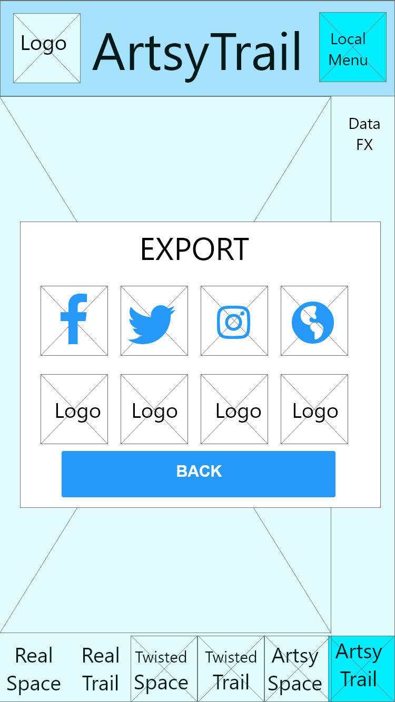

## Phase 2: Interaction Design

Here are some early drafts of our wireframes as exported from Adobe XD at 30% normal size.  They are organized roughly by purpose alongisde our thought processes while creating and refinining them.

### Main Menus

   

### Local Menus

Warren: Not shown is the duplicate About page that links back to this local menu rather than the main one.

### Data Management

    

Warren: We were surprised that our survey 

### RealSpace

### RealTrail

### TwistedSpace

### TwistedTrail

### ArtsySpace

### ArtsyTrail

